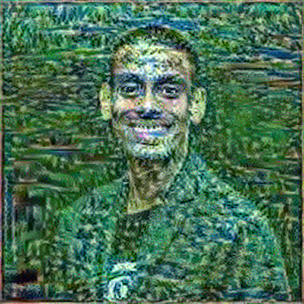

# Neural Style Transfer with TensorFlow and Keras

This repository contains an implementation of neural style transfer using TensorFlow and Keras. The code uses the VGG-19 architecture and aims to transfer the artistic style from one image to the content of another.

## Overview

The neural style transfer algorithm involves training a model to generate an image that combines the content of a target image with the style of a reference image. The implementation here utilizes the VGG-19 model, pretrained on ImageNet, to extract features from both the content and style images.

## Getting Started

### Prerequisites

- **TensorFlow**
- **NumPy**
- **Matplotlib**
- **PIL (Pillow)**

## Install dependencies using:

* pip install tensorflow numpy matplotlib pillow
## Usage
* Clone the repository:
   * git clone https://github.com/Sangha2013/submission.git
   * cd style-transfer
* Update the content_path and style_path variables in the script with the paths to your content and style images.
* Run the Jupyter Notebook:
* jupyter notebook submission.ipynb
  ## Results
   * The trained model will generate a stylized image based on the chosen content and style. Intermediate stylized images will be displayed during training for visual inspection.

## Limitations and Future Improvements
# Limitations:
# Computational Resources:

* The model's performance may be limited by the available computational resources.
# Style Transfer Artifacts:

* Neural style transfer models may produce artifacts such as distortions, color inconsistencies, or unrealistic textures, especially when transferring intricate styles.

# Content-Style Mismatch:

* Achieving a balance between preserving the content of the input image and applying the desired style can be challenging.
  
# Training Data Bias:

* The effectiveness of the model depends on the diversity and quality of the training data.
## Potential Improvements:
 # Model Architecture:

* Explore and experiment with different neural network architectures for style transfer. 
 # Loss Function Tuning:

* Fine-tune the loss functions used during training to place more emphasis on specific aspects, such as texture preservation or color accuracy. 
 # Transfer Learning:

* Utilize transfer learning by pre-training the model on a large dataset of diverse styles before fine-tuning on a specific dataset.
# Post-Processing Techniques:

* Implement post-processing techniques to address artifacts and enhance the visual quality of the stylized images.

## Acknowledgments
* This implementation is based on the principles outlined in the paper "A Neural Algorithm of Artistic Style" by Gatys et al.

## Results
* Content Image                               +                      Style Image            =       Style Transferred Image

* 
    

